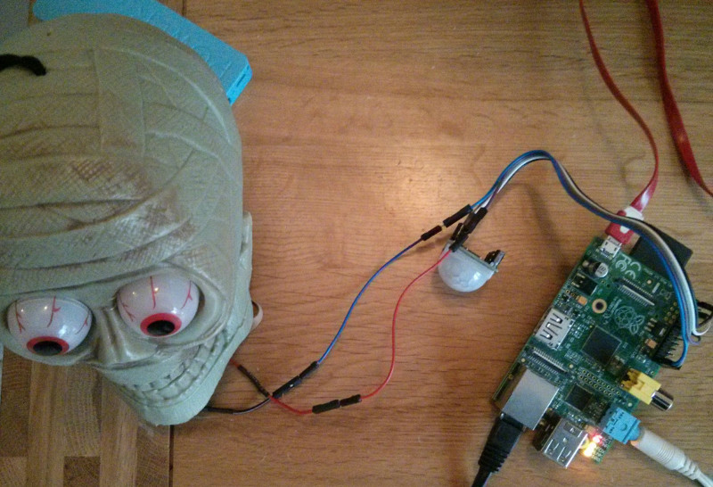

Halloween Scarer
====================

PIR sensor attached to pins 5V, GND and 7 (Board pin 26)
LEDS attached to pins GND and 18 (Board pin 12)

Needs Python Pygame to play the audio track:

    sudo apt-get install python-pygame

To run on boot:

    chmod a+x /home/pi/halloween_scarer/light_zombie.py

    sudo nano /etc/rc.local

Just before the exit 0 line at the bottom, add:

    /home/pi/halloween_scarer/light_zombie.py &

Laugh taken from Freesound.org
http://www.freesound.org/people/DocOne42/sounds/214630/
CC BY-NC 3.0

